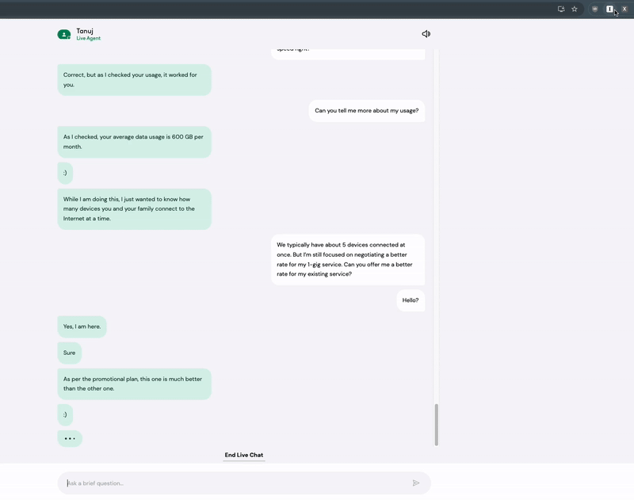

# AI Negotiator for Internet Bill

I built this Chrome extension to help me negotiate my Xfinity internet bill with AI-powered responses. The extension works alongside you in a virtual chat with Xfinity support. It processes your conversation in real-time and uses OpenAI's GPT-4o-mini model to generate strategic responses. Inspired by [this tweet from the CEO of DoNotPay](https://x.com/jbrowder1/status/1602353465753309195) (which unfortunately never launched).

[See the video demo here](https://youtu.be/d3PwmFhY-Hw)




## Features

- 🤖 AI-powered response generation
- 💬 Real-time chat monitoring
- ✏️ Personalized negotiation based on your preferences (e.g. competitor rates, preferred rate, desired services, etc.)


## How it Works

1. The extension monitors your Xfinity chat conversations in real-time
2. Click "Generate Response" to get AI-suggested responses based on the conversation context
3. Review and optionally edit the suggestion
4. Send the response directly to the chat
5. Compare competitor rates in your area to strengthen your negotiation position

## Setup

1. Install dependencies:

```bash
npm install
```

2. Build the project:

```bash
npm run build
```

3. Load the extension in Chrome:
   - Open Chrome and navigate to `chrome://extensions/`
   - Enable "Developer mode"
   - Click "Load unpacked"
   - Select the project root directory

4. Login to your Xfinity account and start a chat with support at https://www.xfinity.com/xfinityassistant. (Skip the automated support agent and ask to speak to a real human agent to use the extension)

## Technical Overview

The extension consists of three main components:

1. **Content Script** (`content.ts`)
   - Monitors the Xfinity chat interface and polls the chat history periodically
   - Handles message insertion

2. **Background Script** (`background.ts`)
   - Manages extension state (chat history, competitor rates, etc.)
   - Handles AI API communication and error handling

3. **Popup Interface** (`popup.ts`, `popup.html`)
   - Displays AI-generated suggestions and chat history
   - Allows you to edit the suggestion before sending, and send the response directly to the chat

Data flows from the chat interface through the content script to the background script, which manages state and generates AI responses, which are then displayed in the popup interface.
